# DD2324 Image analysis

Repository of completed assignments in the course *DD2423 Image Processing and Computer Vision*

## Laboration 1 - Filtering operations

### Fourier transforms

    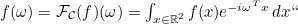
     <em>Continuous fourier transform</em>

    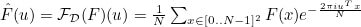
     <em>Discrete fourier transform</em>

### Common Properties of Fourier Transforms

>#### 1. Linearity
>The Fourier transform is a linear operation:
>**F{ a f(x) + b g(x) } = a F(ω) + b G(ω)**
>
>#### 2. Time Shifting
>Shifting a function in time corresponds to a phase shift in the Fourier domain:
>**F{ f(x - x₀) } = e^(-iωx₀) F(ω)**
>
>#### 3. Frequency Shifting
>Multiplying by a complex exponential shifts the frequency domain:
>**F{ e^(iω₀x) f(x) } = F(ω - ω₀)**
>
>#### 4. Scaling
>Scaling in time scales frequency inversely:
>**F{ f(ax) } = (1 / |a|) F(ω / a)**
>
>#### 5. Conjugation
>For the complex conjugate of a function:
>**F{ f*(x) } = F*(-ω)**
>
>#### 6. Differentiation Property
>Differentiation in the time domain corresponds to multiplication in the frequency domain:
>**F{ d/dx f(x) } = iω F(ω)**
>
>#### 7. Convolution Theorem
>The Fourier transform of a convolution is the product of Fourier transforms:
>**F{ f(x) * g(x) } = F(ω) ⋅ G(ω)**
>
>#### 8. Multiplication (Modulation) Theorem
>Multiplication in the time domain corresponds to convolution in the frequency domain:
>**F{ f(x) ⋅ g(x) } = F(ω) * G(ω)**

### Sap noise filtering
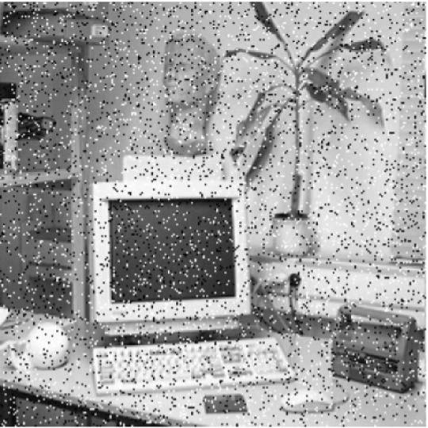
<!---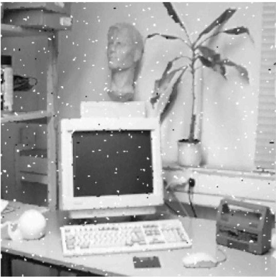
-->
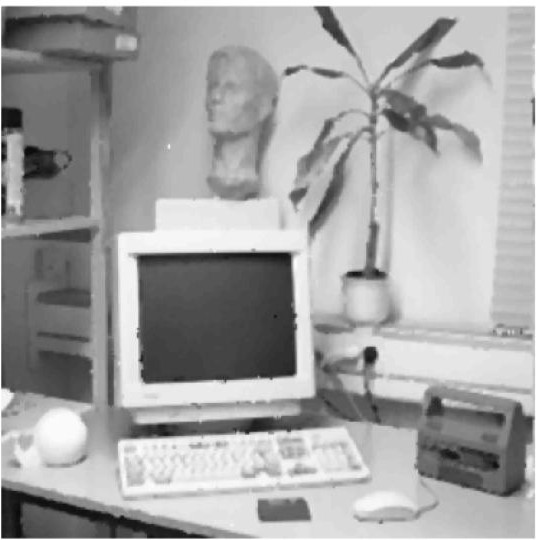

**Left**: image with salt and pepper noise 
**Right**: Median filter applied to noisy image

### Effect of Gauss-smoothing
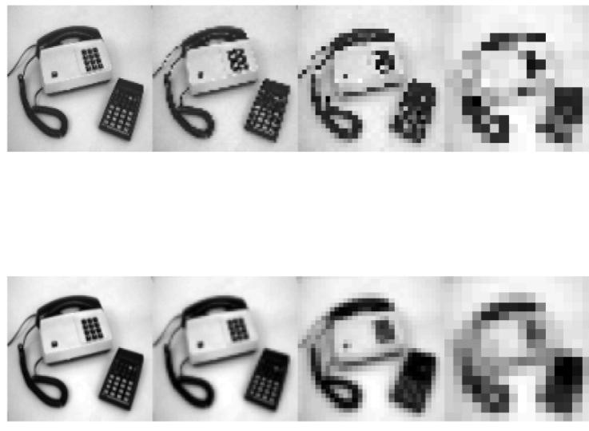

**Top**: Down-sampling  
**Bottom**: Down-sampling with gauss-smoothing

## Laboration 2 - Edge detection & Hough transform

### Difference operators
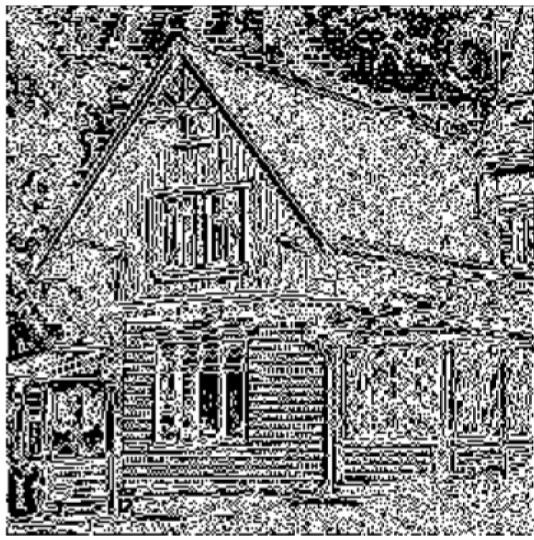
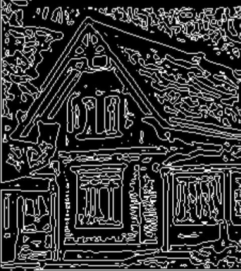

Output of a difference operator with different minimum thresholds.

### Edge detection
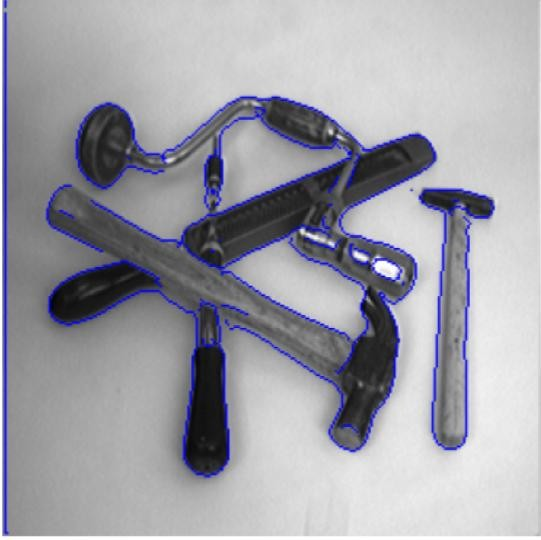

Edge detction combining difference and higher order derivatives

### Hough transform
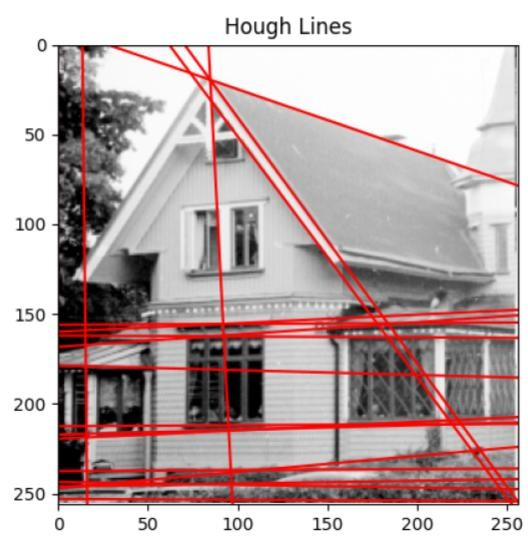

Computing hough lines in direction of most edges

## Laboration 3 -Image segmentation

### K-Means
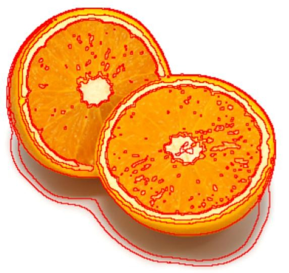

### Mean-shift segmentation
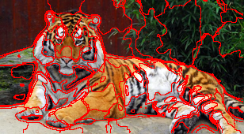
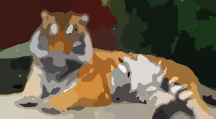

### Normalized cut
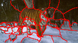

### Graph cut
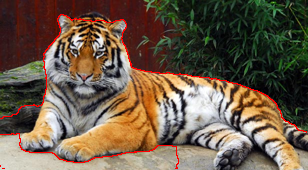

